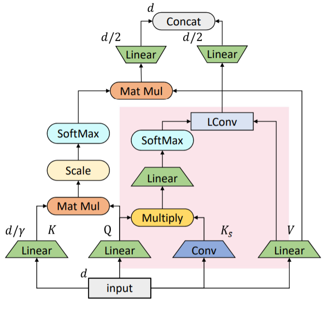

# ConvBERT

## 目录

- [0. 仓库结构]()
- [1. 简介]()
- [2. 数据集和复现精度]()
- [3. 准备数据与环境]()
    - [3.1 准备环境]()
    - [3.2 准备数据]()
    - [3.3 准备模型]()
- [4. 开始使用]()
    - [4.1 模型训练]()
    - [4.2 模型评估]()
    - [4.3 模型预测]()
- [5. 模型推理部署]()
    - [5.1 基于Inference的推理]()
    - [5.2 基于Serving的服务化部署]()
- [6. TIPC自动化测试脚本]()
- [7. 注意]()
- [8. LICENSE]()
- [9. 参考链接与文献]()

## 0. 仓库结构
```bash
root:[./]
|--convbert_base_outputs
|      |--args.json
|      |--best.pdparams
|      |      |--model_config.json
|      |      |--model_state.pdparams
|      |      |--tokenizer_config.json
|      |      |--vocab.txt
|--convbert_infer
|      |--inference.pdiparams
|      |--inference.pdiparams.info
|      |--inference.pdmodel
|      |--tokenizer_config.json
|      |--vocab.txt
|--deploy
|      |--inference_python
|      |      |--infer.py
|      |      |--README.md
|      |--serving_python
|      |      |--config.yml
|      |      |--convbert_client
|      |      |      |--serving_client_conf.prototxt
|      |      |      |--serving_client_conf.stream.prototxt
|      |      |--convbert_server
|      |      |      |--inference.pdiparams
|      |      |      |--inference.pdmodel
|      |      |      |--serving_server_conf.prototxt
|      |      |      |--serving_server_conf.stream.prototxt
|      |      |--PipelineServingLogs
|      |      |      |--pipeline.log
|      |      |      |--pipeline.log.wf
|      |      |      |--pipeline.tracer
|      |      |--pipeline_http_client.py
|      |      |--ProcessInfo.json
|      |      |--README.md
|      |      |--web_service.py
|--images
|      |--convbert_framework.jpg
|      |--py_serving_client_results.jpg
|      |--py_serving_startup_visualization.jpg
|--LICENSE
|--output_inference_engine.npy
|--output_predict_engine.npy
|--paddlenlp
|--print_project_tree.py
|--README.md
|--requirements.txt
|--shell
|      |--export.sh
|      |--inference_python.sh
|      |--predict.sh
|      |--train.sh
|      |--train_dist.sh
|--test_tipc
|      |--common_func.sh
|      |--configs
|      |      |--ConvBERT
|      |      |      |--model_linux_gpu_normal_normal_serving_python_linux_gpu_cpu.txt
|      |      |      |--train_infer_python.txt
|      |--docs
|      |      |--test_serving.md
|      |      |--test_train_inference_python.md
|      |      |--tipc_guide.png
|      |      |--tipc_serving.png
|      |      |--tipc_train_inference.png
|      |--output
|      |      |--python_infer_cpu_usemkldnn_False_threads_null_precision_null_batchsize_null.log
|      |      |--python_infer_gpu_usetrt_null_precision_null_batchsize_null.log
|      |      |--results_python.log
|      |      |--results_serving.log
|      |      |--server_infer_gpu_pipeline_http_usetrt_null_precision_null_batchsize_1.log
|      |--README.md
|      |--test_serving.sh
|      |--test_train_inference_python.sh
|--tools
|      |--export_model.py
|      |--predict.py
|--train.log
|--train.py
```

## 1. 简介
**论文:** [ConvBERT: Improving BERT with Span-based Dynamic Convolution](https://arxiv.org/abs/2008.02496)

摘要： 像BERT及其变体这样的预训练语言模型最近在各种自然语言理解任务中取得了令人印象深刻的表现。然而，BERT严重依赖全局自注意力块，因此需要大量内存占用和计算成本。 虽然它的所有注意力头从全局角度查询整个输入序列以生成注意力图，但我们观察到一些头只需要学习局部依赖，这意味着存在计算冗余。 因此，我们提出了一种新颖的基于跨度的动态卷积来代替这些自注意力头，以直接对局部依赖性进行建模。新的卷积头与其余的自注意力头一起形成了一个新的混合注意力块，在全局和局部上下文学习中都更有效。 我们为 BERT 配备了这种混合注意力设计并构建了一个ConvBERT模型。实验表明，ConvBERT 在各种下游任务中明显优于BERT及其变体，具有更低的训练成本和更少的模型参数。 值得注意的是，ConvBERT-base 模型达到86.4GLUE分数，比ELECTRA-base高0.7，同时使用不到1/4的训练成本。


<div align="center">
    
</div>

## 2. 数据集和复现精度

数据集为`SST-2`。

| 模型      | sst-2 dev acc (复现精度) |
|:---------:|:----------:|
| ConvBERT | 0.9461   |


## 3. 准备环境与数据

### 3.1 准备环境

* 下载代码

```bash
git clone https://github.com/junnyu/ConvBERT-Prod.git
```

* 安装paddlepaddle

```bash
# 需要安装2.2及以上版本的Paddle，如果
# 安装GPU版本的Paddle
pip install paddlepaddle-gpu==2.2.0
# 安装CPU版本的Paddle
pip install paddlepaddle==2.2.0
```

更多安装方法可以参考：[Paddle安装指南](https://www.paddlepaddle.org.cn/)。

* 安装requirements

```bash
pip install -r requirements.txt
```

### 3.2 准备数据

`SST-2`数据已经集成在`paddlenlp`仓库中。

### 3.3 准备模型

如果您希望直接体验评估或者预测推理过程，可以直接根据第2章的内容下载提供的预训练模型，直接体验模型评估、预测、推理部署等内容。


## 4. 开始使用

### 4.1 模型训练

* 单机单卡训练

```bash
export CUDA_VISIBLE_DEVICES=0
python -m paddle.distributed.launch --gpus "0" train.py \
    --model_type convbert \
    --model_name_or_path convbert-base \
    --task_name sst-2 \
    --max_seq_length 128 \
    --learning_rate 1e-4 \
    --num_train_epochs 3 \
    --output_dir ./convbert_base_outputs/ \
    --logging_steps 100 \
    --save_steps 400 \
    --batch_size 32   \
    --warmup_proportion 0.1
```

部分训练日志如下所示。

```
====================================================================================================
global step 2500/6315, epoch: 1, batch: 394, rank_id: 0, loss: 0.140546, lr: 0.0000671182, speed: 3.7691 step/s
global step 2600/6315, epoch: 1, batch: 494, rank_id: 0, loss: 0.062813, lr: 0.0000653589, speed: 4.1413 step/s
global step 2700/6315, epoch: 1, batch: 594, rank_id: 0, loss: 0.051268, lr: 0.0000635996, speed: 4.1867 step/s
global step 2800/6315, epoch: 1, batch: 694, rank_id: 0, loss: 0.133289, lr: 0.0000618403, speed: 4.1769 step/s
eval loss: 0.342346, acc: 0.9461009174311926,
eval done total : 1.9056718349456787 s
====================================================================================================
```

* 单机多卡训练

```bash
export CUDA_VISIBLE_DEVICES=0,1,2,3
python -m paddle.distributed.launch --gpus "0,1,2,3" train.py \
    --model_type convbert \
    --model_name_or_path convbert-base \
    --task_name sst-2 \
    --max_seq_length 128 \
    --learning_rate 1e-4 \
    --num_train_epochs 3 \
    --output_dir ./convbert_base_outputs/ \
    --logging_steps 100 \
    --save_steps 400 \
    --batch_size 32   \
    --warmup_proportion 0.1
```

更多配置参数可以参考[train.py](./train.py)的`get_args_parser`函数。

### 4.2 模型评估

该项目中，训练与评估脚本同时进行，请查看训练过程中的评价指标。

### 4.3 模型预测

* 使用GPU预测

```
python tools/predict.py --model_path=./convbert_base_outputs/best.pdparams
```

对于下面的文本进行预测

`the problem , it is with most of these things , is the script .`

最终输出结果为`label_id: 0, prob: 0.9959235191345215`，表示预测的标签ID是`0`，置信度为`0.9959`。

* 使用CPU预测

```
python tools/predict.py --model_path=./convbert_base_outputs/best.pdparams --device=cpu
```
对于下面的文本进行预测

`the problem , it is with most of these things , is the script .`

最终输出结果为`label_id: 0, prob: 0.995919406414032`，表示预测的标签ID是`0`，置信度为`0.9959`。

## 5. 模型推理部署

### 5.1 基于Inference的推理

Inference推理教程可参考：[链接](./deploy/inference_python/README.md)。

### 5.2 基于Serving的服务化部署

Serving部署教程可参考：[链接](deploy/serving_python/README.md)。


## 6. TIPC自动化测试脚本

以Linux基础训练推理测试为例，测试流程如下。

* 运行测试命令

```bash
bash test_tipc/test_train_inference_python.sh test_tipc/configs/ConvBERT/train_infer_python.txt whole_train_whole_infer
```

如果运行成功，在终端中会显示下面的内容，具体的日志也会输出到`test_tipc/output/`文件夹中的文件中。

```
 Run successfully with command - python train.py --save_steps 400      --max_steps=6315           !  
 Run successfully with command - python tools/export_model.py --model_path=./convbert_base_outputs/best.pdparams --save_inference_dir ./convbert_infer      !  
 Run successfully with command - python deploy/inference_python/infer.py --model_dir ./convbert_infer --use_gpu=True               > ./test_tipc/output/python_infer_gpu_usetrt_null_precision_null_batchsize_null.log 2>&1 !  
 Run successfully with command - python deploy/inference_python/infer.py --model_dir ./convbert_infer --use_gpu=False --benchmark=False               > ./test_tipc/output/python_infer_cpu_usemkldnn_False_threads_null_precision_null_batchsize_null.log 2>&1 !  
```


* 更多详细内容，请参考：[ConvBERT TIPC测试文档](./test_tipc/README.md)。
* 如果运行失败，可以先根据报错的具体命令，自查下配置文件是否正确，如果无法解决，可以给Paddle提ISSUE：[https://github.com/PaddlePaddle/Paddle/issues/new/choose](https://github.com/PaddlePaddle/Paddle/issues/new/choose)；如果您在微信群里的话，也可以在群里及时提问。

## 7. 注意
为了可以使用静态图导出功能，本项目修改了paddlenlp仓库中的convbert模型，主要修改部分如下。
- 1. 使用`paddle.shape`而不是`tensor.shape`获取tensor的形状。
- 2. `F.unfold`对于静态图不怎么友好，只好采用`for`循环。
```python
if self.conv_type == "sdconv":
    bs = paddle.shape(q)[0]
    seqlen = paddle.shape(q)[1]
    mixed_key_conv_attn_layer = self.key_conv_attn_layer(query)
    conv_attn_layer = mixed_key_conv_attn_layer * q

    # conv_kernel_layer
    conv_kernel_layer = self.conv_kernel_layer(conv_attn_layer)
    conv_kernel_layer = tensor.reshape(
        conv_kernel_layer, shape=[-1, self.conv_kernel_size, 1])
    conv_kernel_layer = F.softmax(conv_kernel_layer, axis=1)
    conv_out_layer = self.conv_out_layer(query)
    conv_out_layer = paddle.stack(
        [
            paddle.slice(F.pad(conv_out_layer, pad=[
                            self.padding, self.padding], data_format="NLC"), [1], starts=[i], ends=[i+seqlen])
            for i in range(self.conv_kernel_size)
        ],
        axis=-1,
    )
    conv_out_layer = tensor.reshape(
        conv_out_layer,
        shape=[-1, self.head_dim, self.conv_kernel_size])
    conv_out_layer = tensor.matmul(conv_out_layer, conv_kernel_layer)
    conv_out = tensor.reshape(
        conv_out_layer,
        shape=[bs, seqlen, self.num_heads, self.head_dim])
```

## 8. LICENSE

本项目的发布受[Apache 2.0 license](./LICENSE)许可认证。

## 9. 参考链接与文献

TODO
