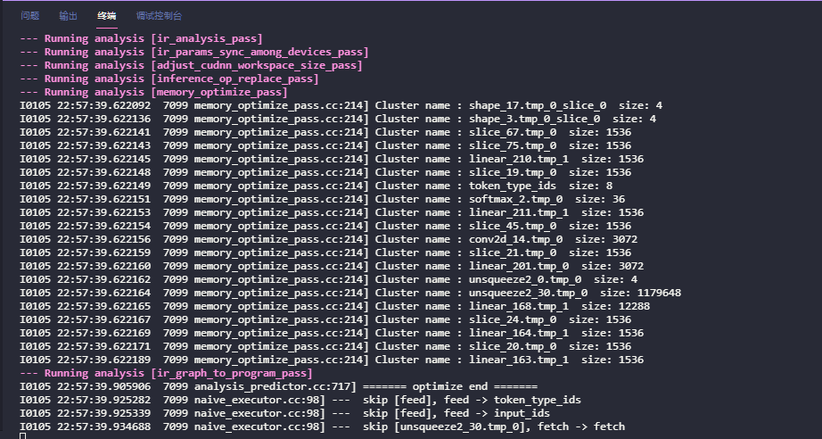

# Serving 服务化部署


# 目录

- [1. 简介]()
- [2. 部署流程]()
    - [2.1 准备部署环境]()
    - [2.2 准备服务化部署模型]()
    - [2.3 启动模型预测服务]()
    - [2.4 客户端访问服务]()
- [3. FAQ]()


## 1. 简介

Paddle Serving依托深度学习框架PaddlePaddle旨在帮助深度学习开发者和企业提供高性能、灵活易用的工业级在线推理服务。

本文档讲解基于Paddle Serving的ConvBERT模型服务化部署。

如果希望查看更多关于Serving的介绍，可以前往Serving官网：[https://github.com/PaddlePaddle/Serving](https://github.com/PaddlePaddle/Serving)。

## 2. 部署流程

### 2.1 准备部署环境

建议在docker中进行服务化部署。

1. 首先准备docker环境，AIStudio环境已经安装了合适的docker。如果是非AIStudio环境，请[参考文档](https://github.com/PaddlePaddle/PaddleOCR/blob/release/2.3/doc/doc_ch/environment.md)中的 "1.3.2 Docker环境配置" 安装docker环境。

2. 然后安装Paddle Serving三个安装包，paddle-serving-server，paddle-serving-client 和 paddle-serving-app。

```bash
wget https://paddle-serving.bj.bcebos.com/test-dev/whl/paddle_serving_server_gpu-0.7.0.post102-py3-none-any.whl
pip install paddle_serving_server_gpu-0.7.0.post102-py3-none-any.whl
# 如果是cuda10.1环境，可以使用下面的命令安装paddle-serving-server
# wget https://paddle-serving.bj.bcebos.com/test-dev/whl/paddle_serving_server_gpu-0.7.0.post101-py3-none-any.whl
# pip install paddle_serving_server_gpu-0.7.0.post101-py3-none-any.whl

wget https://paddle-serving.bj.bcebos.com/test-dev/whl/paddle_serving_client-0.7.0-cp37-none-any.whl
pip install paddle_serving_client-0.7.0-cp37-none-any.whl

wget https://paddle-serving.bj.bcebos.com/test-dev/whl/paddle_serving_app-0.7.0-py3-none-any.whl
pip install paddle_serving_app-0.7.0-py3-none-any.whl
```

如果希望获取Paddle Serving Server更多不同运行环境的whl包下载地址，请参考：[下载页面](https://github.com/PaddlePaddle/Serving/blob/v0.7.0/doc/Latest_Packages_CN.md)

### 2.2 准备服务化部署模型

Serving部署依赖于`jit.save`得到的Inference模型，如果没有Inference模型，可以参考[首页文档](../../README.md)。导出Inference模型。

并使用下面命令，将静态图模型转换为服务化部署模型，即`convbert_server`文件夹中的模型。

```bash
cd deploy/serving_python
python -m paddle_serving_client.convert --dirname  ../../convbert_infer/ --model_filename inference.pdmodel --params_filename inference.pdiparams --serving_server convbert_server --serving_client convbert_client
```

最终`serving_server`文件夹中会生成server端所用到的内容，`serving_client`文件夹中生成client端所用到的内容。


### 2.3 启动模型预测服务

以下命令启动模型预测服务：

```bash
python web_service.py
```

服务启动成功的界面如下：



### 2.4 客户端访问服务

以下命令通过客户端访问服务：

```
python pipeline_http_client.py
```
如果访问成功，终端中的会输出如下内容。

```
{'err_no': 0, 'err_msg': '', 'key': ['label_id', 'prob'], 'value': ['[0]', '[0.995919]'], 'tensors': []}
```

## 3. FAQ

1. 如果在模型转换时报错，比如`AttributeError: 'Program' object has no attribute '_remove_training_info'`，可以将paddle更新到2.2版本。

2. 如果访问不成功，可能设置了代理影响的，可以用下面命令取消代理设置。

```bash
unset http_proxy
unset https_proxy
```
3. 本地使用的是cpu进行的部署，需要开启gpu，需要修改`config.yml`文件。
