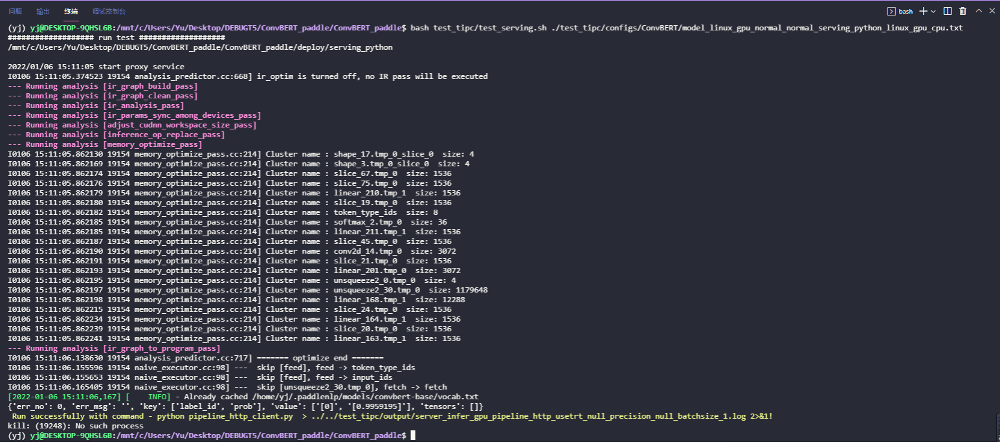

# PaddleServing预测功能测试

PaddleServing预测功能测试的主程序为`test_serving.sh`，可以测试基于PaddleServing的部署功能。

## 1. 测试结论汇总

基于训练是否使用量化，进行本测试的模型可以分为`正常模型`和`量化模型`，这两类模型对应的Serving预测功能汇总如下：

| 模型类型 |device | batchsize | tensorrt | mkldnn | cpu多线程 |
|  ----   |  ---- |   ----   |  :----:  |   :----:   |  :----:  |
| 正常模型 | GPU | 1 | - | - | - |

## 2. 测试流程

### 2.1 准备环境

* 首先准备docker环境，AIStudio环境已经安装了合适的docker。如果是非AIStudio环境，请[参考文档](https://github.com/PaddlePaddle/PaddleOCR/blob/release/2.3/doc/doc_ch/environment.md)中的 "1.3.2 Docker环境配置" 安装docker环境。

* 然后安装Paddle Serving三个安装包，paddle-serving-server，paddle-serving-client 和 paddle-serving-app。

```bash
wget https://paddle-serving.bj.bcebos.com/test-dev/whl/paddle_serving_server_gpu-0.7.0.post102-py3-none-any.whl
pip install paddle_serving_server_gpu-0.7.0.post102-py3-none-any.whl

wget https://paddle-serving.bj.bcebos.com/test-dev/whl/paddle_serving_client-0.7.0-cp37-none-any.whl
pip install paddle_serving_client-0.7.0-cp37-none-any.whl

wget https://paddle-serving.bj.bcebos.com/test-dev/whl/paddle_serving_app-0.7.0-py3-none-any.whl
pip install paddle_serving_app-0.7.0-py3-none-any.whl
```

如果希望获取Paddle Serving Server更多不同运行环境的whl包下载地址，请参考：[下载页面](https://github.com/PaddlePaddle/Serving/blob/v0.7.0/doc/Latest_Packages_CN.md)


### 2.2 准备模型

下载inference模型到`ConvBERT_paddle`目录，

```bash
从百度云下载convbert_infer.zip，当然也可以自己训练然后转换。 #TODO
# 您也可以将inference模型放在当前文件夹，压缩后上传至github，然后使用下面的命令解压
unzip convbert_infer.zip
```

### 2.3 测试功能

运行`test_serving.sh`进行测试，最终在`test_tipc/output`目录下生成`serving_infer_*.log`后缀的日志文件。

```bash
bash test_tipc/test_serving.sh ./test_tipc/configs/ConvBERT/model_linux_gpu_normal_normal_serving_python_linux_gpu_cpu.txt
```  

#### 运行结果

<div align="center">
    
</div>

各测试的运行情况会打印在 `test_tipc/output/results_serving.log` 中：
运行成功时会输出：

```
 Run successfully with command - python pipeline_http_client.py  > ../../test_tipc/output/server_infer_gpu_pipeline_http_usetrt_null_precision_null_batchsize_1.log 2>&1!  
...
```

运行失败时会输出：

```
 Run failed with command - python pipeline_http_client.py  > ../../test_tipc/output/server_infer_gpu_pipeline_http_usetrt_null_precision_null_batchsize_1.log 2>&1!  
Run failed with command - xxxxx
...
```

详细的预测结果会存在 test_tipc/output/ 文件夹下，例如`server_infer_gpu_pipeline_http_usetrt_null_precision_null_batchsize_1.log`中会返回类别ID以及置信度:

```
{'err_no': 0, 'err_msg': '', 'key': ['label_id', 'prob'], 'value': ['[0]', '[0.99591]'], 'tensors': []}
```

## 3. 更多教程

本文档为功能测试用，更详细的Serving预测使用教程请参考：[ConvBERT 服务化部署](../../deploy/serving/README.md)  
