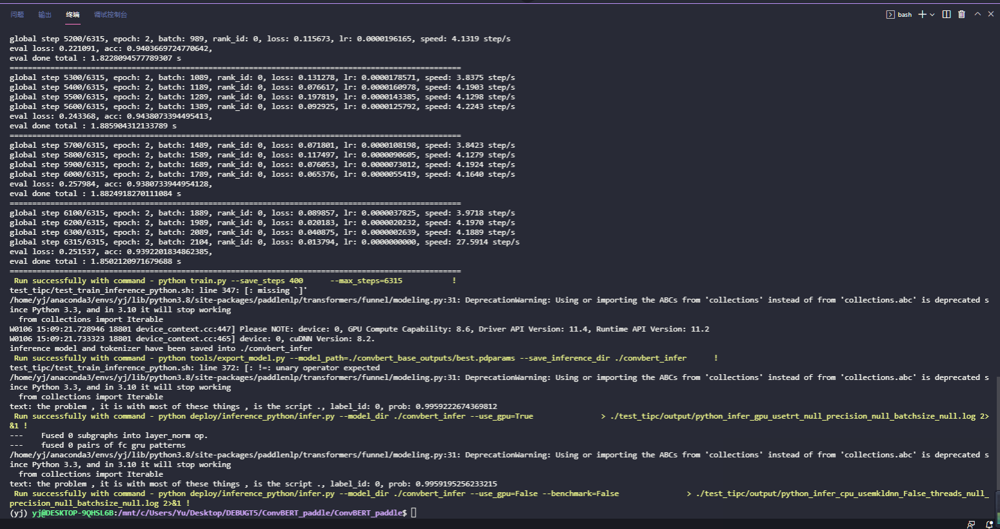

# Linux端基础训练推理功能测试

Linux端基础训练推理功能测试的主程序为`test_train_inference_python.sh`，可以测试基于Python的模型训练、评估、推理等基本功能，包括裁剪、量化、蒸馏。

## 1. 测试结论汇总

- 训练相关：

| 算法名称 | 模型名称 | 单机单卡 | 单机多卡 | 多机多卡 | 模型压缩（单机多卡） |
|  :----: |   :----:  |    :----:  |  :----:   |  :----:   |  :----:   |
|  ConvBERT  | ConvBERT| 正常训练 | - | - | - |


- 推理相关：基于训练是否使用量化，可以将训练产出的模型可以分为`正常模型`和`量化模型`，这两类模型对应的推理功能汇总如下，

| 算法名称 | 模型名称 | 模型类型 |device | batchsize | tensorrt | mkldnn | cpu多线程 |
|  :----:   |  :----: |   ----   |  :----:  |   :----:   |  :----:  |   :----:   |  :----:  |
|  ConvBERT   |  ConvBERT |  正常模型 | GPU | 1/1 | - | - | - |
|  ConvBERT   |  ConvBERT | 正常模型 | CPU | 1/1 | - | - | - |


## 2. 测试流程

### 2.1 准备数据

无，自动下载

### 2.2 准备环境


- 安装PaddlePaddle >= 2.2
- 安装AutoLog（规范化日志输出工具）
    ```
    pip install git+https://hub.fastgit.org/LDOUBLEV/AutoLog
    ```

### 2.3 功能测试

<div align="center">
    
</div>

测试方法如下所示，希望测试不同的模型文件，只需更换为自己的参数配置文件，即可完成对应模型的测试。

```bash
bash test_tipc/test_train_inference_python.sh ${your_params_file} lite_train_whole_infer
```

以ConvBERT的`Linux GPU/CPU 基础训练推理测试`为例，命令如下所示。

```bash
bash test_tipc/test_train_inference_python.sh test_tipc/configs/ConvBERT/train_infer_python.txt whole_train_whole_infer
```

输出结果如下，表示命令运行成功。

```
 Run successfully with command - python train.py --save_steps 400      --max_steps=6315           !  
 Run successfully with command - python tools/export_model.py --model_path=./convbert_base_outputs/best.pdparams --save_inference_dir ./convbert_infer      !  
 Run successfully with command - python deploy/inference_python/infer.py --model_dir ./convbert_infer --use_gpu=True               > ./test_tipc/output/python_infer_gpu_usetrt_null_precision_null_batchsize_null.log 2>&1 !  
 Run successfully with command - python deploy/inference_python/infer.py --model_dir ./convbert_infer --use_gpu=False --benchmark=False               > ./test_tipc/output/python_infer_cpu_usemkldnn_False_threads_null_precision_null_batchsize_null.log 2>&1 !  
```

**【注意】**

如果运行失败，也会在终端中输出运行失败的日志信息以及对应的运行命令。可以基于该命令，分析运行失败的原因。

```
TODO
```


## 3. 更多教程

本文档为功能测试用，更丰富的训练预测使用教程请参考：  

* [模型训练、预测、推理教程](../../README.md)  
